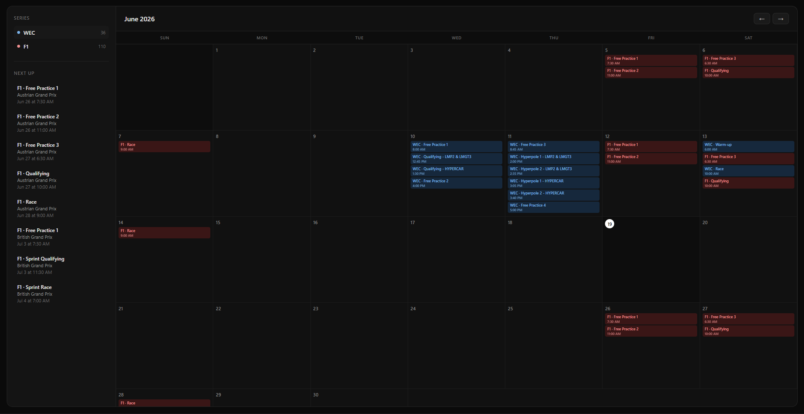

# 🏁 Race Calendar

A multi-series motorsport calendar that pulls together race schedules from WEC, F1, and more — all displayed in one clean, dark-themed monthly calendar. Demo Here: https://chriscoleman1508.github.io/race-calendar/


_Replace this with an actual screenshot or GIF of the calendar in action._

## Features

- 📅 Month-grid calendar view with events color-coded by series
- 🌍 Automatic timezone conversion — every session displays in the visitor's local time
- 🏎️ Multi-series support (currently WEC and F1, more series planned)
- 📋 Sidebar with series breakdown and upcoming sessions
- 🔄 Daily automated data updates via GitHub Actions
- 💻 No backend required — fully static site, hosted free on GitHub Pages

## How it works

```
Scrapers/          Python scripts that fetch race schedule data
  wec_scraper.py    Scrapes FIA WEC's official site for session times
  f1_scraper.py     Pulls F1 schedule from the Jolpica API (Ergast replacement)

docs/               The website itself (served by GitHub Pages)
  index.html        Page structure
  style.css         Styling
  script.js         Calendar logic, data loading, rendering
  data/             JSON files generated by the scrapers
    wec.json
    f1.json

.github/workflows/  GitHub Actions automation
  scrape.yml        Runs the scrapers daily and commits updated data
```

### The data pipeline

1. **Scrapers run automatically** every day via GitHub Actions, fetching the latest race schedules
2. **Session times are stored as Unix timestamps** (UTC) — a universal, unambiguous point in time
3. **The browser converts timestamps to local time** on the fly using JavaScript's `Date` object, so every visitor sees correct times no matter where they are in the world
4. **No server, no API calls at runtime** — the site just reads static JSON files, which is why it can run entirely free on GitHub Pages

## Tech stack

- **Frontend:** Plain HTML, CSS, and JavaScript — no frameworks, no build step
- **Data collection:** Python (`requests`, `BeautifulSoup`)
- **Automation:** GitHub Actions (scheduled scraping + auto-commit)
- **Hosting:** GitHub Pages (free, static)

## Running locally

```bash
git clone https://github.com/yourusername/race-calendar.git
cd race-calendar/docs
python -m http.server 8000
```

Then open `http://localhost:8000` in your browser.

> Note: opening `index.html` directly (double-clicking the file) won't work — browsers block local file fetches for security reasons. A local server like the one above is required for development.

## Running the scrapers

```bash
pip install -r requirements.txt
python Scrapers/wec_scraper.py
python Scrapers/f1_scraper.py
```

This regenerates the JSON files in `docs/data/`.

## Roadmap

- [ ] IMSA support (blocked by Cloudflare protection — exploring alternatives)
- [ ] ELMS, GT World Challenge, MotoGP scrapers
- [ ] Click a race for a full weekend detail page
- [ ] Follow/star specific races (saved via `localStorage`)
- [ ] Filter calendar by series
- [ ] Special events category for one-off races (24H Spa, 24H Nürburgring)
- [ ] Countdown banner to the next race

## License

MIT — feel free to use, modify, and learn from this project.
